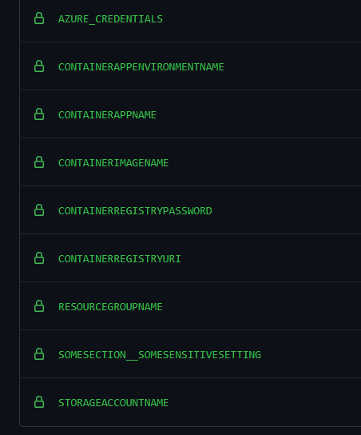
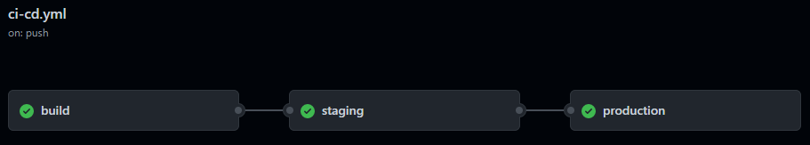
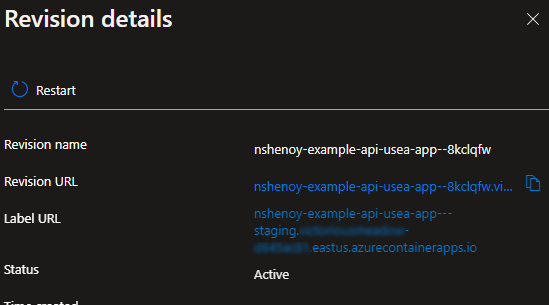

# Implementing Staging -> Production "Slot Swaps" with Azure Container Apps

#### *A sample Azure Container App implementation to demonstrate how to simulate something similar to an Azure App Service staging / production slots swaps.*

This repo deploys a trivial .NET 6 Web API to an Azure Container Apps instance using GitHub Actions. The workflow will first deploy to a revision labeled as "staging" and then allow the user to promote the revision to "production." This methodology closely mimics the staging/production slot workflow typically used in Azure Web Apps. 

This is somewhat based on [Dennis Zielke](https://github.com/denniszielke)'s alternative (and excellent) [blue/green implementation for Container Apps](https://github.com/denniszielke/blue-green-with-containerapps). Whereas Dennis uses environment variables to achieve blue/green, this repo uses the concept of [Revision Labels](https://docs.microsoft.com/en-us/azure/container-apps/revisions#revision-labels) to achieve something closer to Azure Web App slots. Revision labels gives deterministic URLs based on the label, whereas Dennis's implementation requires knowledge of the revision specific FQDN.

## Assumptions

This example assumes familiarity with Bicep for Azure resource deployment, and a combination of Powershell and Azure CLI commands in scripts. These can be easily adapted to Terraform or bash or whatever.

The example will also deploy all resources to the Azure East US region. Make sure these resources [are available in your region](https://azure.microsoft.com/en-us/global-infrastructure/services/).

Lastly, this assumes that you have an existing container registry available. This example is using [GitHub Packages](https://docs.github.com/en/packages/learn-github-packages/introduction-to-github-packages). Please follow the steps to connect your account to your GitHub Packages, or modify the container registry steps to suit your registry of choice (Azure Container Registry, DockerHub, etc).

## Prerequisites
In order to setup the environment and execute our GitHub Actions workflow, we'll need to create the following Action Secrets:


Let's populate these with the following steps:

#### 1. `RESOURCEGROUPNAME`
We first need to create a resource group:
```powershell
New-AzResourceGroup -Name 'azure-containerapp-slots-example-usea-rg' -Location eastus
```

Save the resource group name to an Actions secret called `RESOURCEGROUPNAME` 

#### 2. `AZURE_CREDENTIALS`
The GitHub Actions workflow will need at least contributor access to the Azure resource group created above. This can be achieved by following the directions here: https://docs.microsoft.com/en-us/azure/developer/github/connect-from-azure?tabs=azure-cli%2Cwindows#use-the-azure-login-action-with-a-service-principal-secret 

Save the output json of the `az ad sp create-for-rbac` command to a secret called `AZURE_CREDENTIALS`

#### 3. `CONTAINERAPPENVNAME` and `STORAGEACCOUNTNAME`
If you already have an existing Container App Environment created, populate the `CONTAINERAPPENVNAME` secret with this name. Otherwise, deploy the `./deployment/arm/infrastructure.bicep` template to your resource group. This will create the Container App Environment, Log Analytics Workspace, Application Insights instance, and a storage account.

```powershell
New-AzResourceGroupDeployment -ResourceGroupName 'azure-containerapp-slots-example-usea-rg' `
-TemplateFile ./deployment/scripts/infrastructure.bicep `
-applicationInsightsName 'azure-containerapp-slots-example-usea-ai' `
-containerAppEnvironmentName 'azure-containerapp-slots-example-usea-appenv' `
-logAnalyticsWorkspaceName 'azure-containerapp-slots-example-usea-logws' `
-storageAccountName 'caexampleapiuseasa'
```

Save the `CONTAINERAPPENVNAME` and `STORAGEACCOUNTNAME` as Actions secrets.

#### 4. `CONTAINERREGISTRYURI` and `CONTAINERREGISTRYPASSWORD`
Populate these values with your GitHub Packages URI and a GitHub personal access token setup with `read:packages` and `write:packages` permissions. Why use a PAT instead of the built-in [GITHUB_TOKEN](https://docs.github.com/en/actions/security-guides/automatic-token-authentication) secret that's automatically available? The reason is that the workflow for progressing the revision from staging to production may exceed the timeout for the ephemeral token. So while `GITHUB_TOKEN` is suitable (and recommended) for the build step to push the container image to the GitHub Packages repository, the Azure side of things will need a longer lasting token to deal with the deployment stuff.

#### 5. `CONTAINERIMAGENAME`
This will be the name of the container image that we will build and push to our registry. In this example, we set this to `example-api`

#### 6. `CONTAINERAPPNAME`
The `CONTAINERAPPNAME` secret will be the name of the Azure Container App resource we will create with our Bicep template. In this example, it will be set to `nshenoy-example-api-usea-app`.


#### 7. `SOMESECTION_SOMESENSITIVESETTING`
Set this to some arbitrary string. The value will be used in the deployment step to prove that we can update an appSettings.json value with a secret.

## The Workflow
At a high level, the [pipeline yaml](./.github/workflows/ci-cd.yml) looks like this:



### Build Job

The **`build`** job is quite straightforward. The templates and deployment scripts will be published as build artifacts to be used by the deployment stages. The container image is built and pushed to our GitHub Packages repository.

### Staging Job

Next we have the **`staging`** job. The first main step is to run the `Get-ContainerAppProductionRevision.ps1` script to determine if a revision with a `production` label exists.
```yaml
    - name: Get Revision with Production Label
      id: getProductionRevision
      uses: azure/powershell@v1
      with:
        inlineScript: |
          $productionRevision = ( ./scripts/Get-ContainerAppProductionRevision.ps1 -resourceGroupName ${{ env.resourceGroupName }} -containerAppName ${{ env.containerAppName }} )
          echo "containerAppProductionRevision=$productionRevision" | Out-File -FilePath $Env:GITHUB_ENV -Encoding utf8 -Append
```

The script uses `az containerapp ingress show` to determine if there is a revision with a "production" label in place. The script either returns the revision name or a value of 'none' if the label doesn't exist, the output of which will become a new environment variable called `containerAppProductionRevision`.

Next we run a "variable substition" step, which will replace `#{}` based tokens in our `containerApp.parameters.json` template file with environment variables. 

The Bicep template is then deployed. And here we have to do some trickery. The first trick is the `containerapp_revision_uniqueid` parameter:
```bicep
...
param containerapp_revision_uniqueid string = newGuid()
...
```
```bicep
          env: [
            ...
            {
              name: 'containerapp_revision_uniqueid'
              value: containerapp_revision_uniqueid
            }
```

In order to force a [revision-scope change](https://docs.microsoft.com/en-us/azure/container-apps/revisions#revision-scope-changes), we set this `containerapp_revision_uniqueid` params default value to a new GUID with each Bicep deployment.

The next bit of trickery is setting the ingress properties of the Container App:
```bicep
      ingress: containerAppProductionRevision != 'none' ? {
        external: useExternalIngress
        targetPort: containerPort
        transport: 'auto'
        traffic: [
          {
            latestRevision: true
            label: 'staging'
            weight: 0
          }
          {
            revisionName: containerAppProductionRevision
            label: 'production'
            weight: 100
          }
        ]
      } : {
        external: useExternalIngress
        targetPort: containerPort
        transport: 'auto'
      }
```
Here we use a ternary operator to switch behavior off of the `containerAppProductoinRevision` parameter. If the previous `Get-ContainerAppProductionRevision.ps1` step returned a revision name with a production label, then we have to setup the ingress traffic rules such that `production` remains with 100% of the traffic, but the latest revision we're deploying is set to 0%. In other words, don't mess with the current Production slot. Otherwise, if there was no previous production slot defined, then there's no traffic rules to define (yet). This is the crux of getting this slot-like behavor to work.

Next we run the `Set-ContainerAppStagingLabel.ps1` script to apply the `staging` label to the latest revision.

At this point, the latest container image is staged. We can then test to make sure it functions as needed. The revision FQDN can be retrieved from the Azure portal by going to your Container App -> Revision management and then clicking on your staging labeled revision.



The "Label URL" will always be the Container App name with `---staging` appended to the end.

### Producton Job

Finally the **`production`** job will run the `Swap-ContainerAppRevisions.ps1` to swap revision labels and verify that the `production` label has 100% of the traffic.
